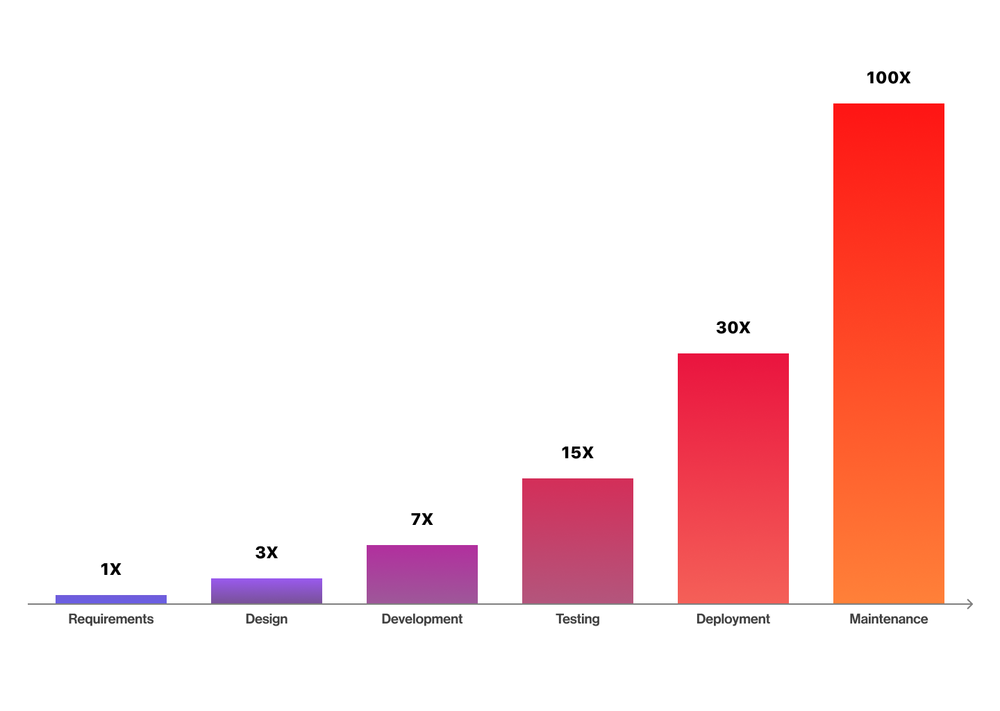
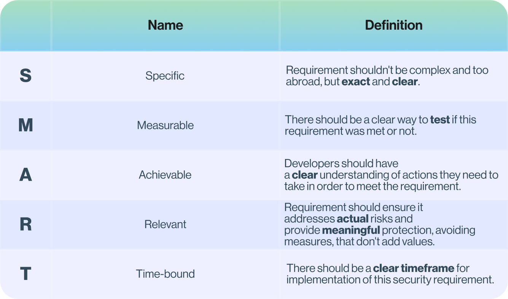
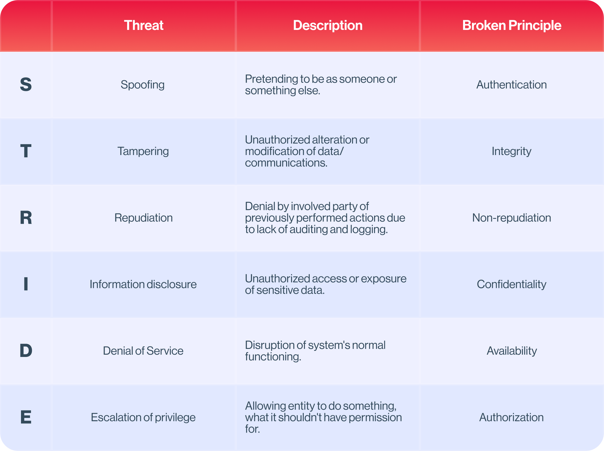
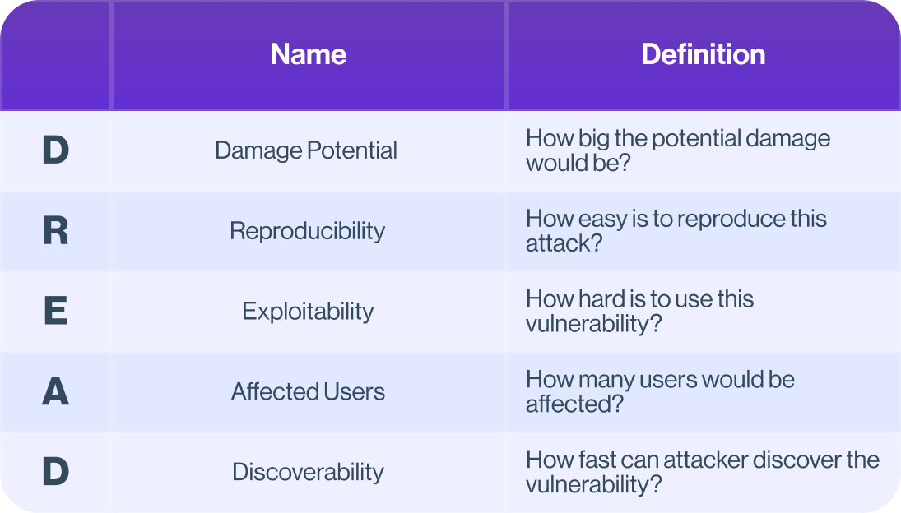
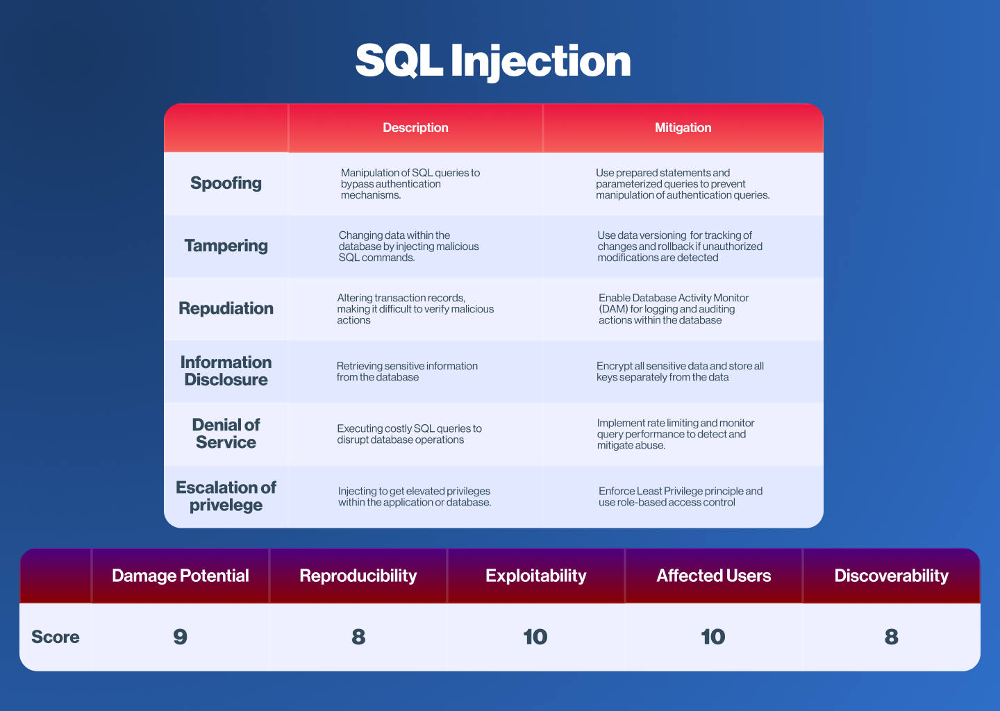

# Application Security Engineer Starter Kit

# Understanding basics of Application Security
In the face of increasing cyberattacks, application security is becoming critical, requiring developers to integrate robust measures and best practices to build secure applications.

### What "Secure Application" means?
When we say **application is secure**, it means that application ensures 3 core security principles of its protected resources named **CIA Triad**:

**C** - Confidentiality\
Only authorized entities have access to specified resource or information. 

**I** - Integrity\
Data transferred between users and systems remain unchanged from the source to the destination. 

**A** - Availability\
In the event of failures or attacks, data and services are continuously available to authorized users.
___

While CIA Triad forms the foundation of security principles, true security is not a one-time effort.\
Security is an **ongoing** process, and core role of AppSec is to **ensure security on every stage of software development lifecycle (SDLC)**.

# Security in SDLC
Software development lifecycles consists from 6 stages:


Quickly identifying threats significantly reduces the cost of mitigation, preventing incidents from progressing into serious problems:



As we see, identification at deployment and maintenance phases are most expensive.\
To identify threats faster, we should try to use some structured security approaches at each phase of SDLC to minimize risk of costly vulnerabilities.

## Requirements
We need clarify **security requirements** separately from **functional requirements**. They define what application should do to **stay secure** and shouldn't do to **elevate threats**.

Good security requirement follows **SMART** principle:



One of the ways to build security requirements are **abuser stories**.
Main idea is in watching at application in malicious actor's point of view, trying to abuse application.

**Example**:\
*Abuser*:  I want to brute users' passwords to get access to the account.

*Security requirements*: 
1. Rate limit authorization requests to 5 requests per minute. Deadline:  3 days.
2. Implement MFA (Multi-Factor authorization) via user's email. Deadline: 30 days.

## Design
Now we need to use our security requirements, gathered from previous phase and apply secure design principles.
For that purpose we need to model threats and define mitigation measures as well as select templates and frameworks that allow us to ensure security.


### Core Secure Design Principles
#### Use Least Privilege Principle
Grant users and systems only **minimum** required permissions. Even if an application becomes vulnerable, attack surface will dramatically decrease.

For instance, application should not have access to all tables in database, but only to **required** ones.

#### Zero Trust
Don't trust users or services, even if they are located in the corporate network.

You should always **authenticate** and **authorize** entity and check if it has enough **permissions** to do this action, for instance through centralized Auth Server.

#### Secure By Default
Security should be the foundation of your system and must be built on solid and proven principles.

**Don't** rely on **security through obscurity**.\
Security of the system should **not** depend on the fact, that its details are unknown to attackers.

For instance, if your web server is **Netty** based, [OWASP Netryx Armor](https://github.com/OWASP/www-project-netryx) security framework can configure your server to protect you from HTTP/2 0day attacks, DoS Attacks and applies browser security policies to responses out of box.

#### Auditing and Logging
**Non-repudiation** is core aspect of auditing and logging, ensuring that actions and events can't be denied by the involved party.

Auditing allows to **identify** attacks in progress, while logging helps to **reveal** how attack is performed. All security actions in the system must be transparent and verifiable to ensure integrity.

#### Defense in Depth
Security **shouldn't** rely on a **single** layer. It should involve using multiple layers of security controls, ensuring that if one layer fails, other layers will provide protection, including **host**, **network**, **application** security and measures regarding **human factor**.

For instance, an **Intrusion Detection System** (IDS) and **Web Application Firewall** (WAF) can be deployed as additional layers to protect network and application from different types of attacks. [OWASP Netryx]()'s IDS can help you in deep analysis of **Netty** based web application traffic in a reactive way.

### Threat Modeling
Threat modeling includes its identification and rating.\
**Identification** to recognize **influence aspects** of the threat, while **rating** to calculate its **severity**.

One of the most popular frameworks for threat identification is **STRIDE**:



Now we can calculate the risk by using **DREAD** framework. Each category in the model is scored from 0 to 10. 
The sum of the scores in all categories is **total risk score**.



Example of building STRIDE and DREAD models for **SQL Injection**:


Our **DREAD** score for SQL Injection is: 9+8+10+10+8 = **45** out of **50**, that shows very big severity of this vulnerability.

Take attention, that during classifying the threat through **STRIDE**, we not only handled how to fix SQL Injection, but also covered
potentially vulnerable parts of the system, that allowed us to increase overall security of our system. 

## Development
At this step we must ensure our code is built on **Secure Coding** principles to be resilient against potential vulnerabilities and threats:

### Input validation
**Don't trust user input!**\
It's important to check both the **syntax** of submitted structured fields like **phone numbers** and **email addresses**, with their **semantics**, such as ensuring that a **quantity** is above **0**, or that a **username**'s length is less than **64** characters.

Make sure if you validate input via **Regex** it is not vulnerable to **ReDoS** attacks. Always set a **time limit** for regex execution.

Improper or absent input validation is the reason of nearly 80% most popular web application vulnerabilities, including:
* **SQL Injection**
* **XSS Injection**
* **Path Traversal Attack**

#### SQL Injection
Injection occurs when an attacker inserts a malicious SQL sequences via input.  

**Vulnerable code**:
```java
String query = "SELECT * FROM users WHERE username = '" + username + "' AND password = '" + password + "'";
```

If user submits `admin' --`, it will comment out the password check:
```sql
SELECT * FROM users WHERE username = 'admin' --' AND password = ''
```

**Secure code**
```java
String username = validate(usernameFromInput);

PreparedStatement pstmt = connection.prepareStatement("SELECT * FROM users WHERE username = ? AND password = ?");
pstmt.setString(1, username); 
pstmt.setString(2, password);
```
You need to **validate** input and use **PreparedStatement**, **ORM** frameworks (like **Hibernate**) or database access libraries (**JOOQ**) that will safely escape all inputs.
Just data validation in case of SQL Injection most time is **not enough**, but it is **important** part of mitigation.

#### XSS Injection
XSS Attack targets users, where goal is to execute malicious **JavaScript** in a browser.

Imagine you have such HTML template:
```html
<!DOCTYPE html>
<html xmlns:th="http://www.thymeleaf.org">
<head>
    <title>XSS Example</title>
</head>
<body>
    <h1>XSS Example</h1>
    <div th:text="${message}"></div>
</body>
</html>

```
**Vulnerable code**
```java
@Controller  
public class XSSController {
    @GetMapping("/xss")  
    public String xss(@RequestParam(name = "message") String message, Model model) {  
        model.addAttribute("message", message);  
        return "xss";  
    }  
}
```

**Secure code**
```java
@Controller  
public class XSSController {
    @GetMapping("/xss")  
    public String xss(@RequestParam(name = "message") String message, Model model) {  
        model.addAttribute("message", StringEscapeUtils.escapeHtml4(message));  
        return "xss";  
    }  
}
```
You must escape the input, that will be displayed to users in different contexts.

#### Path traversal
Path traversal allows an attacker to access files and directories outside the scope of the root catalog of the server.

**Vulnerable code**
```java
@Controller  
public class FileDownloadController {  
    private static final Path ROOT = Paths.get("/var/www/files");  
  
    @GetMapping("/download")  
    public ResponseEntity<Resource> download(@RequestParam("filename") String filename) throws IOException {  
        Path file = ROOT.resolve(filename);  
  
        Resource resource = new UrlResource(file.toUri());  
  
        if (resource.exists())  
            return ResponseEntity.ok().body(resource);  
        else 
            return ResponseEntity.notFound().build();  
    }  
}
```
If user specifies `../../../../etc/passwd` as a filename, it would return `/etc/passwd` because of parent directory symbols.

**Secure code**
```java
@Controller  
public class FileDownloadController {  
    private static final Path ROOT = Paths.get("/var/www/files");  
  
    @GetMapping("/download")  
    public ResponseEntity<Resource> download(@RequestParam("filename") String filename) throws IOException {  
        Path file = resolve(filename);  
          
        Resource resource = new UrlResource(file.toUri());  
  
        if (resource.exists())  
            return ResponseEntity.ok().body(resource);  
        else 
            return ResponseEntity.notFound().build();    
    }  
  
    private static Path resolve(String fileName) {  
        // We need to normalize it and check if we are still in our directory
        var finalPath = ROOT.resolve(fileName)  
                .toAbsolutePath()  
                .normalize();  
  
        if (!finalPath.startsWith(ROOT))  
            throw new IllegalArgumentException("Path traversal");  
  
        return finalPath;  
    }  
}
```

You can use security frameworks for input validation:
* [OWASP Netryx]()
* [OWASP ESAPI]()* *JavaEE only*

### Access control
Access control plays a key role in the security of the application and according to [OWASP Top 10](https://owasp.org/Top10/), **broken access control** is one of the most popular security issues.

#### Mandatory Access Control (MAC)
MAC is system-enforced access control, that uses clearance and labels to control access.
It assigns **security levels** to users and resources and only allows access, whether these levels **match**.

Security level for users shows their level of trust; for data it indicates how sensitive is it. For instance, classifications in government include: **TOP SECRET**, **SECRET**, **CONFIDENTIAL**, and **UNCLASSIFIED**.

#### Discretionary Access Control (DAC)
DAC is a security mechanism, where a **resource owner** defines who can access it.
In the DAC every resource (file, catalogue etc.) contains access attributes, that define who can read/write or interact with it.

A prime example of DAC you can see in the **Unix filesystem**.
#### Role-Based Access Control (RBAC)
This is flexible approach to build access control system, where **permissions** to users or services are assigned based on their **role**.

It is fundamental security mechanism in **Spring Security**:

```java
@Component  
@EnableWebSecurity  
public class SecurityConfig {  
  @Bean  
  public SecurityFilterChain secure(HttpSecurity http) throws Exception {  
        return http.authorizeHttpRequests(authorize -> authorize
                .requestMatchers("/user/**").hasRole("USER")  
                .requestMatchers("/admin/**").hasRole("ADMIN")  
                .anyRequest()  
                .authenticated()  
        )  
        .build();  
    }  
}
```

You can also check roles using **Spring Method Security**:

```java
@Secured({"ROLE_ADMIN"})  
public void adminMethod() {  
 
}  
  
@PreAuthorize("hasRole('SUPPORT')")  
public void supportMethod() {  
  
}
```
___

#### Session Management
If you use Session based authentication, make sure after successfull authorization previous session drops and becomes invalid while creating a fresh one with **unique session id**. There after, you are not vulnerable to **Session Fixation** attacks:
```java
@Bean  
public SecurityFilterChain secure(HttpSecurity http) throws Exception {  
    return http.sessionManagement(session -> session.sessionFixation().migrateSession())  
            .build();  
}
```

Moreover, it is mandatory to enable **CSRF Tokens** for user-side endpoints to be protected from **CSRF Attacks**:
```java
@Bean  
public SecurityFilterChain secure(HttpSecurity http) throws Exception {
    return http.sessionManagement(session -> session.sessionFixation().migrateSession())
            .csrf(csrf -> csrf.csrfTokenRepository(/* your repository */))
            .build();
}
```

Most time **1** CSRF Token **per session** is enough, but the best practice is to update CSRF Token after **every request**.
####

### Error handling
Improper error handling may give bad actors a hint of inner works of application that is considered as **information disclosure**.

Use centralized exception handler and make sure:
* You **don't** include **package names** or **stack trace** into error messages.
* You handle **checked** exceptions properly.
* **RuntimeException** or **Exception** are **not** thrown directly, instead own exceptions that **extend** these classes are used.
* **No sensitive data** is logged during exception handling.

**Vulnerable code**
```java
@ControllerAdvice  
public class BadExceptionHandler {  
    @ExceptionHandler(Exception.class)  
    public ResponseEntity<Object> handle(Exception ex) {
        return new ResponseEntity<>(ex.getMessage(), HttpStatus.INTERNAL_SERVER_ERROR);  
    }  
}
```

**Secure code**
```java
@ControllerAdvice  
public class GoodExceptionHandler {  
    private static final Logger LOGGER = LoggerFactory.getLogger(GoodExceptionHandler.class);  
  
    @ExceptionHandler(CustomException.class)  
    public ResponseEntity<String> handle(CustomException ex) {  
        // Better define common error view for exceptions
        return new ResponseEntity<>(ex.getShortMessage(), HttpStatusCode.valueOf(ex.getCode()));  
    }  
  
    // Disable default Spring Boot behaviour, when stacktrace is included to error body
    @ExceptionHandler(Exception.class)  
    public ResponseEntity<Void> handle(Exception ex) {  
        LOGGER.error("Unexpected error occurred", ex);  
        return new ResponseEntity<>(HttpStatus.INTERNAL_SERVER_ERROR);  
    }  
}
```
Include all system thrown exceptions and make sure they are handled properly.

### Cryptography
Never hardcode **sensitive** data in the code and ensure data transmitted over the network is **encrypted** to prevent interception, such as **Man In The Middle** attacks. Don't use **legacy** encryption algorithms, like **DES** to protect confidentiality of your data. Instead, use modern and **efficient** encryption algorithms like **AES-GCM** and **ChaCha20-Poly1305**.

Passwords should be not encrypted, but **hashed** with salt. It is important to use secure random algorithm, such as **java.security.SecureRandom** for generating crypto sequences. 

Use only **slow** hashing algorithms for passwords: Argon2id, SCrypt and BCrypt. Algorithms like SHA-256 are named **fast** and **should not** be used for hashing **sensitive** data, but are great to ensure **integrity** of it. 

**Never** store your password or any other sensitive data (like private keys) as a **String**, use **char[]** or **byte[]** instead and clear them (e.g fill with **zeroes**) as soon, as you complete working with them. This will help to protect against **Data in Use attacks**.

Tools like [OWASP Netryx Memory]() allow you to allocate memory segments and store data there in an obfuscated way, making sure it will never be leaked.

## Testing
### Static Application Security Testing (SAST)
SAST can help you to identify security issues early during the development.
**Manual Source Code Review** and **Automated Static Code Analyzer** (SCA) both are types of SAST, that should be used in tandem, where SCA is used directly **during the development**.

[SonarQube]() and [Checkmarx]() are prime examples of SCA for Java. Integrating SCA during **development** cycle will increase the qualification of developer in the security field, cause after getting the report from SCA he needs to understand the vulnerability to be able to fix it. Most of SCAs include short descriptions of found threats.

### Dynamic Application Security Testing (DAST)
DAST is a security testing methodology, that analyzes web applications in the running state.
SAST is a **white box** testing, while DAST is a **black box** testing, that simulates how an attacker might interact with the application.

Tools like [OWASP ZAP]() and [Burp Suite]() are popular choice for DAST, allowing to run various types of attacks to find potential weaknesses and fix them, before they can be exploited by malicious actor.

## Deployment & Maintenance
### Integrity of packages
### Monitoring
### Updating dependencies

# Recommended to read
[OWASP Cheatsheet]()\
[OWASP Secure Coding Checklist]()\
[OWASP in SDLC]()
