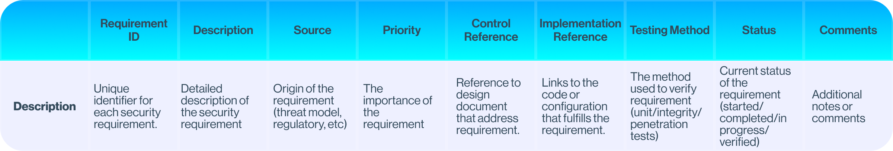
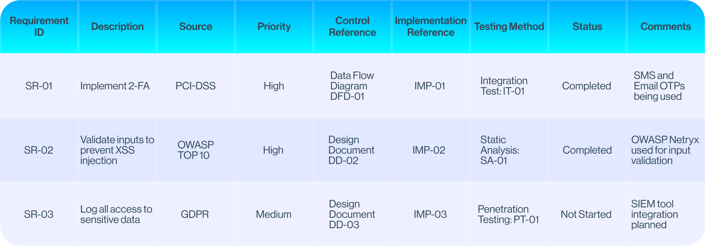

# Security in Requirements phase

Building requirements is one of the first steps in the SDLC, where we define the goals and objectives of our future application. Usually, at this phase, we collect relevant stakeholders and start discussing their needs and expectations. We talk to people who will use the application, those who will manage it, and anyone else who might be affected by it to understand what they want the application to do and how it should work.

During requirements engineering, we need to separate **functional** and **security** requirements. While functional requirements show what an application **should do**, security requirements show what an application **shouldn't do**.

It's important to carefully consider building security requirements because a large part of the system's security depends on them. Good security requirement follows **SMART** principle:

Usually, stakeholders involved in security requirements engineering are:

- Developers
- Security experts
- Project Managers/Architects

All of them can participate in one of the ways to build security requirements: **Security** and **Abuser** stories.

### Security Stories

*As a [role], I want [security feature], so that [benefit]*

Security stories are a special type of user stories, that focus on the security of the system.  
You should look at the application from the perspective of users and stakeholders **who need protection**.

**Examples**:

1. As a developer, I want to ensure that all passwords are stored with strong hashing algorithm so that even if the database is compromised, the passwords remain secure.
2. As a system administrator, I want to log all access to sensitive data so that we can audit and identify any unauthorized access.

### Abuser Stories

*As a [bad guy], I want to [do something bad]*

Abuser stories are the opposite of security stories. Here you need to think like an **attacker**, finding the ways you can **exploit** an application.

**Examples**:

1. As an attacker, I want to perform a brute force attack on the login page to gain access to user accounts.
2. As an attacker, I want to intercept data transmitted over the network to steal sensitive information.

***

So, security and abuser stories allow us to look at the application from both points of view: the user's and the attacker's.  
It is a **proactive** approach, that provides a detailed and scenario-based understanding of security requirements.

Now we need a comprehensive way to ensure our critical assets and potential risks are managed.  
For this, we can use the **FAIR** model:

## Factor analysis of information risk (FAIR)

**FAIR** is a methodology, that helps to assess and manage informational risk in a **financial** terms.  
It includes the following core steps:

1. **Threat** and **Critical Asset** identification - defining valuable assets of the application and identifying related threats for them.
2. **Contact Frequency (СF)** assessment - calculating how frequently the vulnerability interacts with critical asset
3. Calculating **Probability of Action (PoA)** - finding the probability that asset would be attacked
4. **Threat Event Frequency (TEF)** assessment - multiplication of **CF** and **POA**
5. **Vulnerability (Vuln)** assessment - the probability that the attack on the asset would be successful
6. **Loss Event Frequency (LEF)** assessment - multiplication of **TEF** x **Vuln**
7. Defining **Loss Magnitude (LM)** - calculating **Primary Losses** (actual damage in a result of the attack)  
   and **Secondary Losses** (reputation, litigation losses)
8. Calculating **Overall** risk - multiplication of **LEF** x **LM**

Sounds a bit hard, right? As **FAIR** is just **methodology**, not **framework**, there are no concrete ways of **how** you should calculate risks.  

But using simple **Threat Modeling** techniques, we can cover most of these steps:

### Threat Modeling

Threat modeling allows us to **identify** and **rate** threats.  
Identifying threats helps us to understand which security aspects are at risk, while rating ensures we prioritize them in the right way.

To properly identify threat we will use **STRIDE** framework:

So, it allows us to classify a threat in one or more of 6 categories, defining which security aspects are affected.  
After we identified the threat we can calculate the risk by using the **DREAD** framework:

Each category in the model is scored from 0 to 10.  
The sum of the scores in all categories is **total risk score**. Maximum risk score is **50**.  
As an example let's create a STRIDE and DREAD analysis for **SQL Injection**:

Thus, the total risk score for SQL Injection is *9 + 8 + 10 + 10 + 8 =* **45**,

***

After this, we can use **Security & Abuser** stories, **STRIDE** and **DREAD** frameworks to structure our approach with **FAIR** methodology:

#### › Threat and Critical Asset identification

Using **Security & Abuser** stories, we can find critical assets.

- As a developer, I want all user input to be validated to prevent SQL Injection in the database.

From this security story we see, that **database** is our critical asset.  
To identify the influence vectors of the threat, we will use **STRIDE**.

#### › Contact Frequency (СF) assessment

This criteria fully depends on the functional requirements.  
For instance, if our critical asset is the database and vulnerability relates to it,  
the frequency is actually how often will the user interact with the database.

#### › Calculating Probability of Action (PoA)

We can use **Reproducibility** and **Exploitability** scores from the **DREAD** framework.  
For instance, for SQL Injection **Reproducibility** score is **9**, and the **Exploitability** score is **10**.

Then our **PoA** would be *(9 + 10) / 20* = **0.95**

#### › Threat Event Frequency (TEF)

As mentioned before, **TEF** = **CF** x **PoA**.  
For example, if there are 100 user-side interactions with the database, then for SQL Injection:  
**TEF** = *100 x 0.95* = **95** threat events per day.

#### › Vulnerability (Vuln) assessment

For the **Vulnerability** assessment we can use the final **DREAD** score.  
**SQL Injection**'s DREAD score is *9 + 8 + 10 + 10 + 8* = 45/50, or **0.99**.

#### › Loss Event Frequency (LEF)

**LEF** = **TEF** x **Vuln**  
Then for our scenario, **LEF** = *95 x 0.99* = **94** loss events per day.

#### › Loss Magnitude (LM)

Loss Magnitude is calculated by summing potential **primary** and **secondary** losses.  
At this step we don't use any thread modeling approaches, cause it requires more specific analysis.

For instance, let's calculate the imaginary **SQL Injection**'s Loss Magnitude:

- **Primary Losses**:  
  The potential cost of stolen data: *50.000***\  
  Cost of restoration works: *30.000*  
  System downtime: *10.000***\  
  Total : **90.000**
- **Secondary Losses**:  
  Legal and regulatory losses: *60.000***\  
  Increased security costs: *20.000*  
  Total: **80.000$**

Thus, Total Loss Magnitude is *90.000* *+ 80.000* = **170.000$**

#### › Overall Risk

*Potential Overall Risk = LEF(94) x LM(90.000)* = **8.460.000$ per day**

***

By using **STRIDE**, **DREAD**, **Security & Abuser Stories**, and **FAIR**, we learned how to develop strong security requirements.  
The great thing about **FAIR** is that in the end, it translates these risks into **financial** terms, making it much easier for **management** to understand the importance of each security measure. This is especially helpful since it's often **challenging** to convey the significance of security risks to **top executives**.

Now after we have our security requirements and know their financial impacts, we can ensure we don't miss anything by using a **Secure Requirements Traceability Matrix (SRTM)**.

## Security Requirements Traceability Matrix (SRTM)

**SRTM** is a detailed document that links security requirements to their implementation and testing.  
It makes sure that all security needs are handled during development, showing a clear path from the start to the final tests.

Let's imagine that after using the FAIR framework with Security & Abuser Stories,  
we identified the following security requirements:

- Implement 2FA to follow PCI-DSS
- Using input validation to prevent XSS Injection
- Logging access to sensitive assets

In this case, our matrix will look like this:

For building requirements traceability matrix you will use such tools like **YouTrack** or **Jira**.

***

# Summary

In this article, we learned how important it is to build security requirements early in the SDLC.  
By talking to stakeholders and using methods like **Security & Abuser Stories**,  
we can spot critical assets and potential threats from both user and attacker perspectives.

We used **STRIDE** to identify threats, **DREAD** to assess them, and **FAIR** methodology, that allowed us to look at these threats from **all angles** and translate their impact into **financial terms**, making it easier for management to understand their **importance**.

Finally, we talked about the Secure Requirements Traceability Matrix (SRTM), which helps us **track** security requirements from start to finish.  
This ensures that **nothing is missed** and all security needs are properly addressed.

Finding and fixing security issues during the requirements phase can **save millions of dollars** later on. It’s **much cheaper** to address these problems early rather than after the application is built or later SDLC steps.